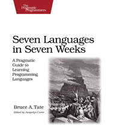

# 7 Languages in 7 Weeks

> My Solution to 7in7

[![7in7][7in7]][7in7-url]
[![License: MIT][license]][license-url]

<a href="https://pragprog.com/book/btlang/seven-languages-in-seven-weeks" target="_blank">
  
<a>

```shell
███████╗██╗███╗   ██╗███████╗
╚════██║██║████╗  ██║╚════██║
    ██╔╝██║██╔██╗ ██║    ██╔╝
   ██╔╝ ██║██║╚██╗██║   ██╔╝
   ██║  ██║██║ ╚████║   ██║
   ╚═╝  ╚═╝╚═╝  ╚═══╝   ╚═╝
```

## Solutions

- [x] [Ruby][ruby-url]
- [ ] [Io][io-url]
- [ ] [Prolog][prolog-url]
- [ ] [Scala][scala-url]
- [ ] [Erlang][erlang-url]
- [ ] [Clojure][clojure-url]
- [ ] [Haskell][haskell-url]

## LICENSE

MIT © [Aung Myo Kyaw](https://github.com/AungMyoKyaw)

[ruby-url]: ./ruby
[io-url]: ./io
[prolog-url]: ./prolog
[scala-url]: ./scala
[erlang-url]: ./erlang
[clojure-url]: ./clojure
[haskell-url]: ./haskell
[license]: https://img.shields.io/badge/License-MIT-brightgreen.svg?style=flat-square
[license-url]: https://opensource.org/licenses/MIT
[7in7]: https://img.shields.io/badge/7in7-AMK-brightgreen.svg?style=flat-square
[7in7-url]: #
